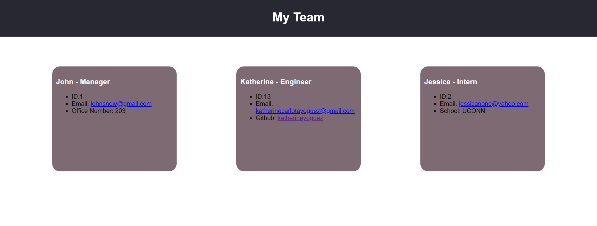

# teamportfoliogenerator

## **Project Summary** ⚡️

_This app is for manager's who would like to generate a webpage that displays their team's basic information that gives them quick access to their emails and Github profile.._

__________________________________________________________________________________________________________________________________________________

## **Tools Used** 🛠️

* HTML
* CSS
* Node js
* Inquirer
* Jest

___________________________________________________________________________________________________________________________________________________

## **Steps**📋

* Through command-line the application accepts user input.
* When prompted for team members information then an html file is generated a team roster.
* Once application is started, you will be prompted to enter the manager’s name, employee ID, email address, and office number. 
* When entered, you are presented with a menu with the option to add an engineer or an intern or create team.
* When selected the engineer option you are prompted to enter the engineer’s name, ID, email, and GitHub username, and is taken back to the menu.
* When selected the intern option you are prompted to enter the intern’s name, ID, email, and school, you are taken back to the menu.
* When you are ready to finish building your team, select create team and HTML is generated.

## **Tests** 

To run test, run npm test in your terminal to check to see if your test pass or failed.

___________________________________________________________________________________________________________________________________________________

## **Website** 📷

___________________________________________________________________________________________________________________________________________________

# 📷 Video

[Live video Demo](https://youtu.be/kVe5HqpcQQg)

___________________________________________________________________________________________________________________________________________________

## **Recourses** 💡

[Katherine Y : Github](https://github.com/katherineyoguez)

[Live website](https://katherineyoguez.github.io/teamprofilegenerator/)

____________________________________________________________________________________________________________________
